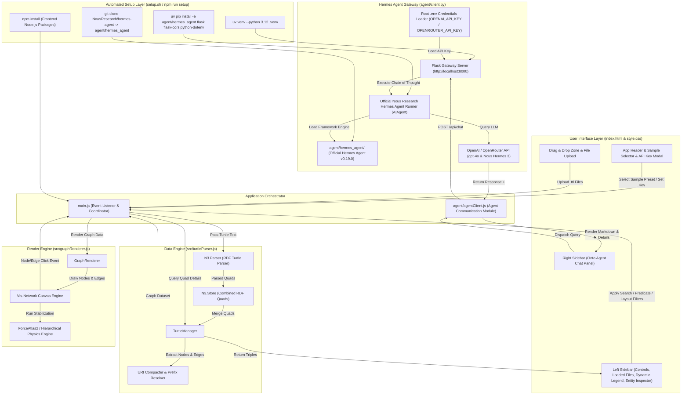

# OntoSphere AI - System Architecture

This document provides a detailed technical architecture overview of **OntoSphere AI**, an interactive, browser-based multi-file RDF Turtle (`.ttl`) graph visualizer, ontology explorer, and **Onto Agent** assistant powered by the official **Nous Research Hermes Agent** framework (`agent/client.py` and `agent/hermes_agent`).

---

## 🏗️ High-Level System Architecture

OntoSphere AI follows a modular, decoupled Single Page Application (SPA) architecture built with **Vite**, **Vanilla ES Modules**, an automated setup orchestrator (`setup.sh`), and a dedicated **Nous Hermes Agent Gateway (`agent/client.py`)**.

---

## 🧩 Core Modules & Component Breakdown

### 1. Automated Setup Orchestrator (`setup.sh` / `npm run setup`)
A single-command deployment script ensuring any agentic IDE or fresh developer environment builds all dependencies automatically:
- Installs Node.js packages (`npm install`).
- Clones official **Nous Research Hermes Agent** (`git clone --depth 1 https://github.com/NousResearch/hermes-agent.git agent/hermes_agent`).
- Provisions Python 3.12 virtual environment using `uv` (`uv venv --python 3.12 .venv`).
- Installs `hermes-agent` v0.19.0 and gateway packages (`uv pip install -e agent/hermes_agent flask flask-cors python-dotenv`).

### 2. `agent/` Directory & Official Hermes Agent Integration
The dedicated module containing all AI Agent gateway and client logic:
- **`agent/client.py`**: Python Flask API server running on port `8000`. Imports official `AIAgent` runner from `agent/hermes_agent/run_agent.py`. Exposes `GET /api/health`, `POST /api/set-key`, and `POST /api/chat` (supporting `gpt-4o`, `gpt-4o-mini`, `nousresearch/hermes-3-llama-3.1-405b`, and `nousresearch/hermes-3-llama-3.1-70b`).
- **`agent/hermes_agent/`**: Cloned official Nous Research Hermes Agent framework (v0.19.0) with reasoning loops, tool calling, and self-improving skill architecture.
- **`agent/requirements.txt`**: Python requirement manifest.
- **`agent/agentClient.js`**: Frontend JavaScript module encapsulating gateway health checks (`checkGatewayHealth`), key updates (`saveApiKey`), and chat requests (`sendAgentQuery`).

### 3. `TurtleManager` (`src/turtleParser.js`)
The data engine responsible for ingestion, parsing, RDF storage, and querying.
- **N3 Library Integration**: Uses W3C-compliant `n3` parser to parse `.ttl` files asynchronously.
- **Multi-File State Store**: Maintains an internal registry of uploaded files (`Map<id, file>`) and an active set (`Set<id>`).
- **Store Merging (`rebuildCombinedStore`)**: Dynamically merges RDF quads from active files into a single unified `N3.Store`.

### 4. `GraphRenderer` (`src/graphRenderer.js`)
The visualization renderer wrapping `vis-network`.
- **Layout Solvers**: Supports Force-Directed network layout and Hierarchical Tree layouts (Top-Down and Left-Right).
- **Semantic Color Palette & HSL Engine**: Categorizes nodes based on RDF class types with deterministic color generation for custom classes.

### 5. Application Orchestrator (`src/main.js`)
The event mediator connecting user inputs, graph canvas events, left Entity Inspector updates, and right-side Onto Agent chat queries with expandable `🧠 Onto Agent Reasoning` accordions.
